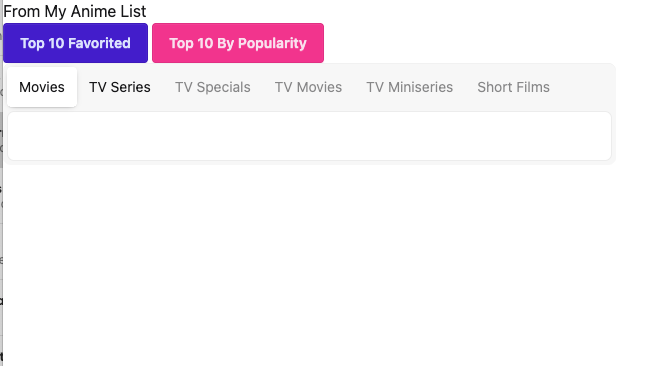
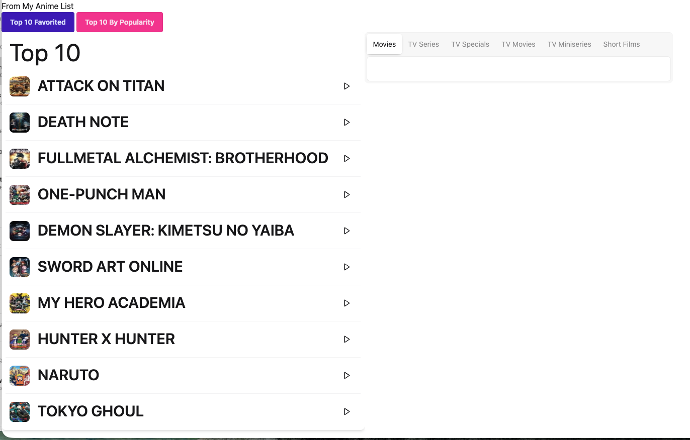
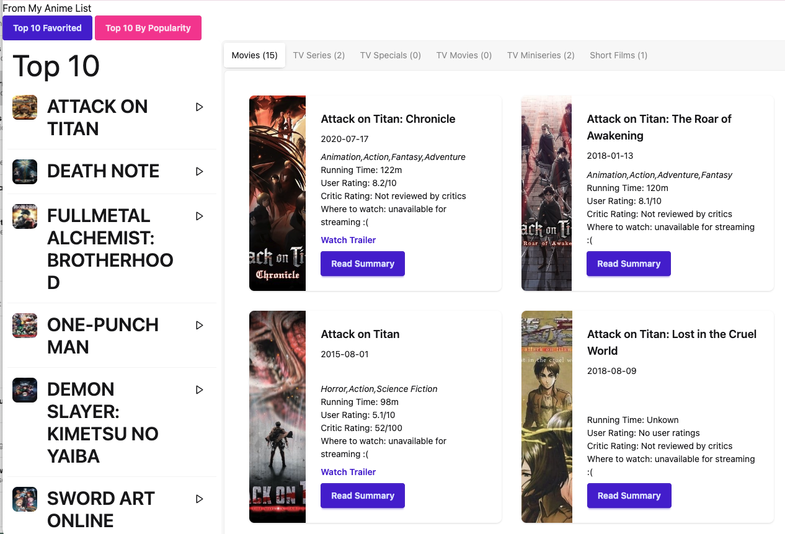

Project Overview 
JACL Anime Streaming Finder helps anime fans answer one simple question:

Where can I watch top-ranking anime movies or TV series?

Instead of jumping between ranking sites and streaming platforms, users can discover popular anime and instantly see where each title is available to watch.

Problem Statement
Where can I consume television and movies for top-ranking anime properties?

Tech Stack
Frontend: HTML, JavaScript
Styling: Daisy UI CSS
APIs:Jikan API (MyAnimeList data), watchmode API (streaming availability)
Tools: Insomnia, Visual Studio Code, GitHub Pages

APIs Used
1. Jikan API (MyAnimeList Data)
Provides top anime rankings, titles, and metadata
Used due to CORS restrictions with the official MyAnimeList API

2. Watchmode API (Streaming Availability)
Converts anime titles into media IDs
Returns available streaming services, rentals, or purchases

User Experience & Screenshots

This section walks through the exact user journey using screenshots from the application.

Landing Page (Screenshots 1 & 2)

What the user sees on page load:

A branded hero section introducing JACL – Your Anime Streaming Compass
Navigation options to explore anime rankings - Clean, minimal layout focused on discovery

⭐ Top 10 by Popularity

When the user clicks Top 10 by Popularity:

The app fetches top-ranked anime from MyAnimeList (via Jikan)

A ranked list populates on the left

▶ Expanding an Anime Property

Clicking the arrow icon ▶:

Loads all related media

Categorized into Movies, TV Series, Specials, etc.

💬 Hover Summary Interaction (Screenshot 5)
Hovering over Read Summary:

Displays a tooltip with a short synopsis

